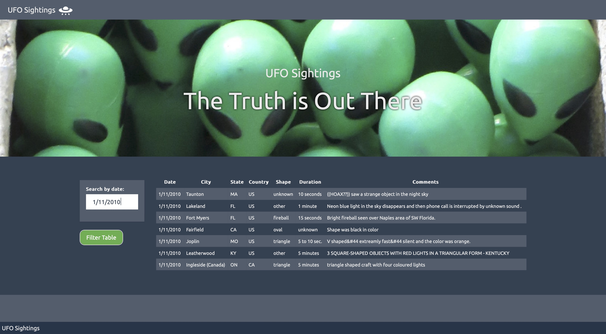

# javascript-challenge

#### TL;DR:
The results are here:
https://colbyhoke.github.io/javascript-challenge/UFO-level-1/
https://colbyhoke.github.io/javascript-challenge/UFO-level-2/

#### The assignment was completed in two levels:
* Level 1 filters the data based on a user-input date.
* Level 2 filters the data based on user input in conjunction with a dropdown to filter by 5 fields:
    * date
    * city
    * state
    * country
    * shape

I did some extra handling:
* Let the enter key be a form submit
* Format the city, state, and country values to look better
* If nothing is entered, then return the default state
* If no matches are found, alert the user and clear any evidence of a table

#### Level 1 results look like:

It's accessible here: https://colbyhoke.github.io/javascript-challenge/UFO-level-1/

#### Level 2 results look like:

It's accessible here: https://colbyhoke.github.io/javascript-challenge/UFO-level-2/

#### Level 2 filter selection looks like:
